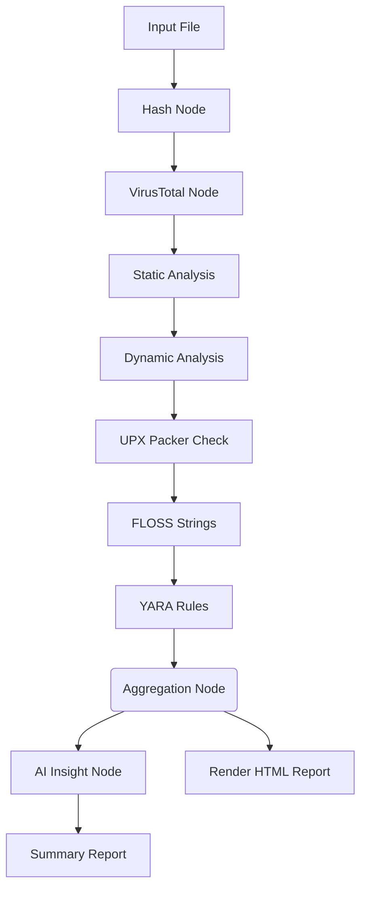

# 🛡 ThreatLens

> ThreatLens — Automated Malware Intelligence Pipeline by **Ahmed ELNajjar**. Upload a binary, get a full threat report: SHA256, UPX packing detection, FLOSS string extraction, VirusTotal lookup, static PE analysis, dynamic sandbox results, YARA rule matching, and an AI-synthesized threat intelligence report — all in one click, powered by LangGraph and Groq AI.

---

## 📁 Project Structure

```text
ThreatLens/
│
├── App.py                         # Streamlit web interface (Main App)
├── config.py                      # Configuration & environment variable loading
├── state.py                       # GraphState TypedDict for the pipeline
├── graph.py                       # LangGraph sequential builder & compiler
├── main.py                        # CLI entry point
├── requirements.txt               # Python dependencies
├── packages.txt                   # Apt dependencies (for cloud deployment)
│
├── nodes/                         # LangGraph Execution Nodes
│   ├── hash_node.py               # SHA256 hashing
│   ├── upx_node.py                # UPX packer detection
│   ├── floss_node.py              # FLOSS string extraction
│   ├── vt_node.py                 # VirusTotal API lookup
│   ├── static_node.py             # Static PE analysis
│   ├── dynamic_node.py            # Dynamic / sandbox analysis
│   ├── yara_node.py               # YARA rule matching
│   ├── aggregation_node.py        # Fan-in aggregator
│   ├── insight_node.py            # LLM threat intelligence report
│   ├── summary_report_node.py     # LLM → premium HTML summary
│   └── render_report_html_node.py # Markdown → full HTML report
│
├── utils/
│   ├── llm.py                     # Groq client wrapper
│   └── yara_loader.py             # YARA rules loader with caching
│
├── rules/                         # Comprehensive YARA rule files
│   ├── malware/
│   ├── packers/
│   └── webshells/
│
└── outputs/                       # Generated reports (auto-created)
```

---

## ⚙️ Pipeline Flow

ThreatLens uses a sequential LangGraph pipeline to systematically analyze malware, ensuring prerequisites (like hashing) finish before dependent nodes execute.



---

## 🚀 Installation & Setup

### 1. Clone the repository

```bash
git clone https://github.com/AhmedELNajjar-dev/Threat-Lens.git
cd Threat-Lens
```

### 2. Install Python dependencies

```bash
pip install -r requirements.txt
```

### 3. Install external tools (Local Development)

- **UPX** — download from https://upx.github.io and add to PATH or project root.
- **FLOSS** — download `floss` or `floss64.exe` from https://github.com/mandiant/flare-floss/releases and place it in the project root.

*Note: For Streamlit Cloud deployment, these are handled via `packages.txt` and linux binaries.*

### 4. Configure Environment Variables

Create a `.env` file in the root directory (do not commit this file) and fill in your keys:

```env
GROQ_API_KEY=your_groq_api_key_here
VT_API_KEY=your_virustotal_api_key_here
```

- **Groq API key** → https://console.groq.com
- **VirusTotal API key** → https://www.virustotal.com/gui/my-apikey

---

## ▶️ Usage

### Run the Streamlit web interface (Recommended)

```bash
streamlit run App.py
```

Then open your browser at `http://localhost:8501`, upload a binary, and click **Run Analysis**.

### Run from CLI

```bash
python main.py
```

> Edit the `file_path` inside `main.py` to point to your test sample.

---

## 📊 Output Reports

After analysis, reports are generated both in the UI and inside the `outputs/` folder:

| File | Description |
|---|---|
| `summary_report.html` | AI-generated premium interactive dashboard |
| `full_report.html` | Full technical report with all module results |
| `insights_report.md` | Raw markdown threat intelligence report |
| `analysis.json` | Aggregated raw data from all modules |

---

## ⚠️ Disclaimer

This tool is intended for **educational and research purposes only**.  
Always analyze malware in an **isolated environment** (VM / sandbox).  
Never run suspicious binaries on your host machine.
